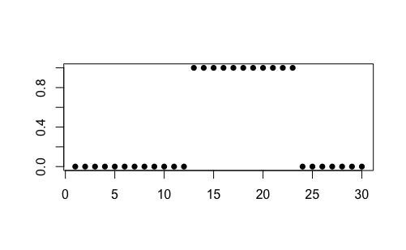
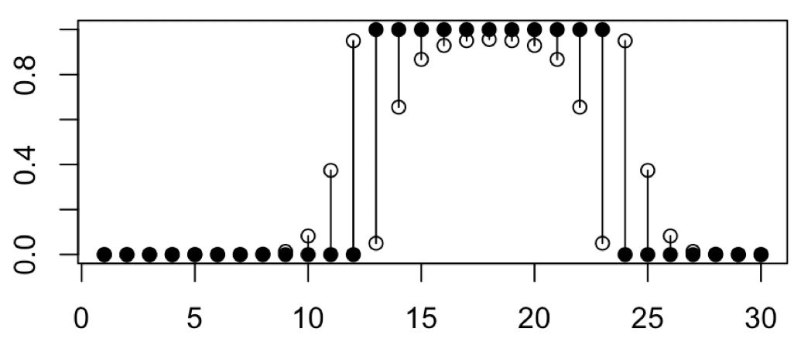

# R package glmdr (Aug/31/2020)

## Exponential Family Generalized Linear Models Done Right

In the generalized linear model, the maximum likelihood estimate (MLE) does not exist in the conventional sense when solutions are "at infinity" in terms of canonical parameters or "on the boundary" in terms of mean value parameters. The glmdr handles this case for the full discrete exponential families generalized linear models (binomial, poisson, multinomial, and product multinomial response). It provides valid hypothesis tests, confidence intervals and its corresponding summary. 
  
## Usage 

```r
library(devtools)
install_github(repo = "DEck13/complete_separation") #This would (?) be changed to the right path (e.g. cjgeyer/glmdr)
library(glmdr)
```

## Illustrative Example 

Example 1: Completely Degenerate Logistic Regression

We show that our model-based solution to the complete separation problem works, and that it provides narrower confidence intervals than competing methods. 
The data is constructed below. 



This data exhibits complete separation and \code{glm} provides a useless error message.
[Add more description].

```r
attach(quadratic)
glmdr_out <- glmdr(y ~ x + I(x^2),  family="binomial")
summary(glmdr_out)
glmdr_out_inf <- inference(glmdr_out)
glmdr_out_inf
```


[Add description]
```r
plot(x, y, ylim = c(0,1), pch = 16, ylab = "", xlab = "")
points(x, glmdr_out_inf[, 1])
points(x, glmdr_out_inf[, 2])
segments(x, glmdr_out_inf[, 1], x, glmdr_out_inf[, 2])
```




To cite this package:
```r
citation("glmdr")
```


## Further details

For more details, please see:

  Geyer, C.J. (2009)
  
  Likelihood inference in exponential families and directions of recession.

  Electronic Journal of Statistics, 3, 259-289.

  http://projecteuclid.org/euclid.ejs/1239716414.
  
<br>

  Eck, D.J. and Geyer, C.J. (submitted)
  
  Computationally efficient likelihood inference in exponential families when the maximum likelihood estimator does not exist.
  
  https://arxiv.org/abs/1803.11240.
